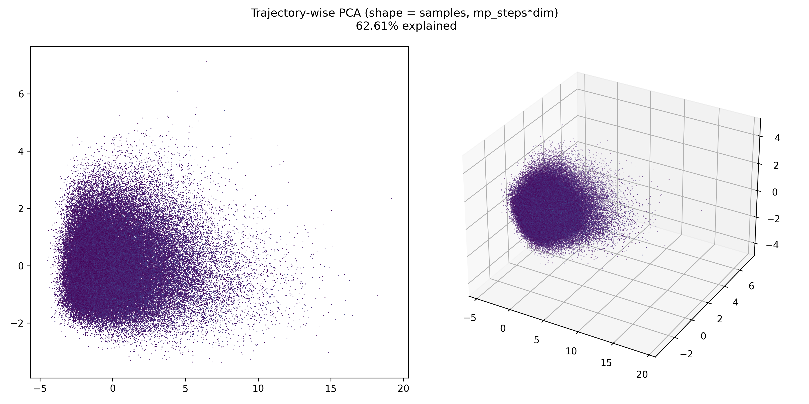
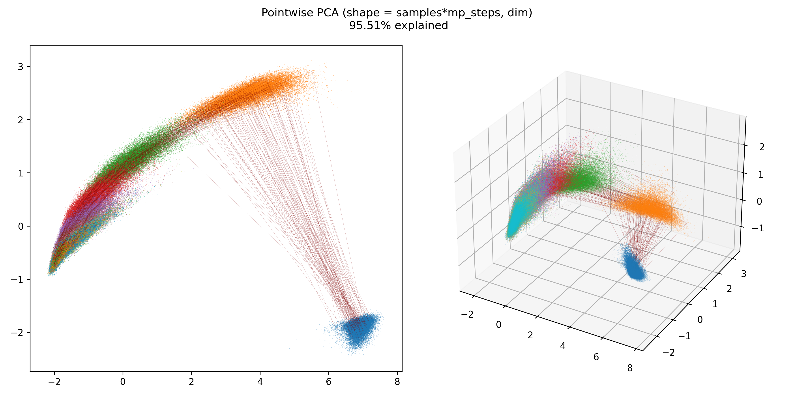
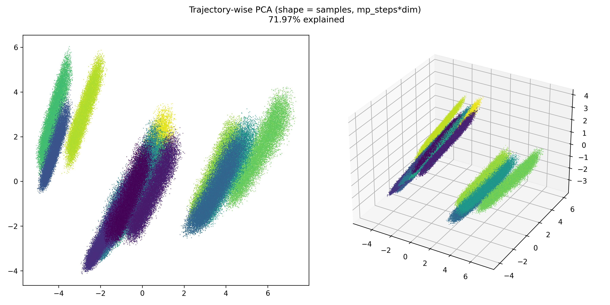
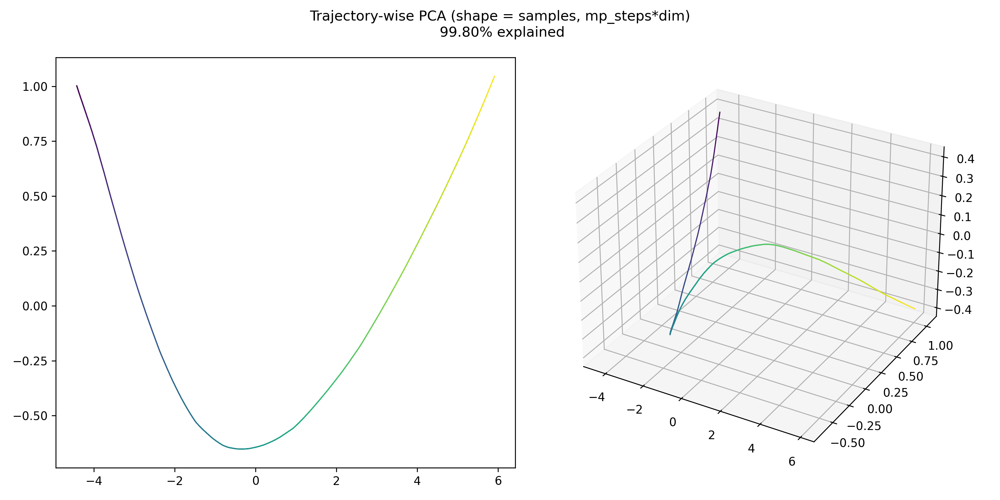
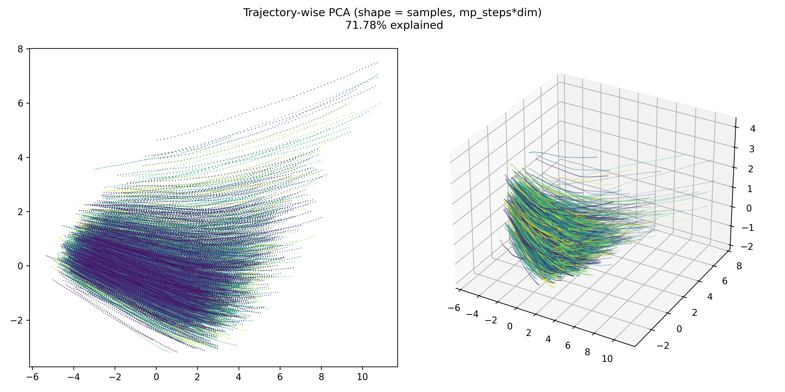

# Latent Space Representations of Neural Algorithmic Reasoners

This repository implements the tools for analysing latent spaces of NARs and their symmetries, 
as described in the paper

[Latent Space Representations of Neural Algorithmic Reasoners](https://arxiv.org/abs/2307.08874)

by Vladimir V. Mirjanić, Razvan Pascanu, and Petar Veličković (ICML 2023 Workshop).

## Abstract

Neural Algorithmic Reasoning (NAR) is a research area focused on designing neural 
architectures that can reliably capture _classical computation_, usually by 
learning to execute algorithms. A typical approach is to rely on Graph Neural Network (GNN)
architectures, which encode inputs in high-dimensional latent spaces that are repeatedly 
transformed during the execution of the algorithm. In this work we perform a detailed 
analysis of the structure of the latent space induced by the GNN when executing algorithms. 

We identify two possible failure modes: 
1. loss of resolution, making it hard to distinguish similar values; 
2. inability to deal with values outside the range observed during training. 

We propose to solve the first issue by relying on a _softmax_ aggregator, and propose to 
decay the latent space in order to deal with out-of-range values. We show that these changes
lead to improvements on the majority of algorithms in the standard CLRS-30 benchmark when 
using the state-of-the-art Triplet-GMPNN processor.

## Examples

Trajectory-wise PCA of random samples in the latent space:



Step-wise PCA of random samples in the latent space:



16 clusters under the reweighting symmetry of Bellman-Ford algorithm:



Latent spaces under scaling symmetry, for one equivalency class:



Latent spaces under scaling symmetry, for many equivalency classes:



## Getting started

This repository is based on Google DeepMind's CLRS Algorithmic Reasoning Benchmark 
[deepmind/clrs](https://github.com/deepmind/clrs).

A standard way to run the code is to first train the NAR with ```run.py```, then to extract
trajectories by passing the ```test``` flag, and finally to use the trajectories in various
Jupyter notebooks to generate graphical visualisations.

### Features and changes

Features present in this repository compared to the original can be summarised as follows:

* In the ```clrs/``` directory, which contains original DeepMind code, we make the following 
changes:
  * We edit ```examples/run.py``` to provide a mechanism for extracting trajectories from 
  samples, as well as the following flags:
    * ```noise_injection_strategy``` enum which sets the type of noise to be added to hiddens 
    after each processor step. Some strategies (```Directional```, etc.) require principal
    to be generated beforehand, while others (```Uniform``` and ```Corrupt```) do not. Default is
    ```Noisefree```.
    * ```softmax_reduction``` boolean to toggle softmax aggregation on or off. Default is 
    ```off```.
    * ```decay``` float to specify amount of decay to apply to the processor. Default is ```1```.
    * ```test``` boolean that, when set, restores trained model and uses it to generate
    trajectories.
    * ```sample_strat```, which is only applicable for the Bellman-Ford algorithm, and controls
    sampling of graphs.
  * We edit ```nets.py``` to add support for softmax, decay, and noise, as well as to
  enable feature extraction.
  * We implement softmax aggregation and linear PGN in ```processors.py```.
  * We modify ```samplers.py``` to allow support for custom sampling methods while remaining
  backwards compatible by wrapping sampling in a stream. We implement multiple sampling
  strategies for Bellman-Ford that target its scaling, permutation, and reweighting symmetries.
* In the ```lsr/``` directory we provide tools for studying the latent space representations.
  * In ```figure_generators/``` are the notebooks used to generate figures from the paper. 
  These notebooks also generate plots that did not make it into the paper or the appendix, 
  but that are useful in their own right.
  *  We are unable to provide the trajectories ourselves due to the GitHub's size limit of 
  2GB per file. However, we provide ample figures in the ```plots/``` directory.
  * In ```alternative_ford.py``` we provide several faulty implementations of Bellman-Ford that
  the correct algorithm is evaluated against.
  * In ```noise_injection.py``` we implement multiple methods of adding noise to embeddings.
  * In ```experment.py``` we automate many plotting functions that are used to generate figures.
* In the ```results/``` directory we provide ```runner.sh``` that was used to run 
the entire test suite (Triplet GPMNN processor, 30000 train steps, seeds in range (42, 47),
softmax aggregation and processor decay both either enabled and disabled). Raw test results 
used to generate tables in the paper are in ```clrs_summary.txt```, and the code that generates
LaTeX tables is in ```summarise.ipynb```.
